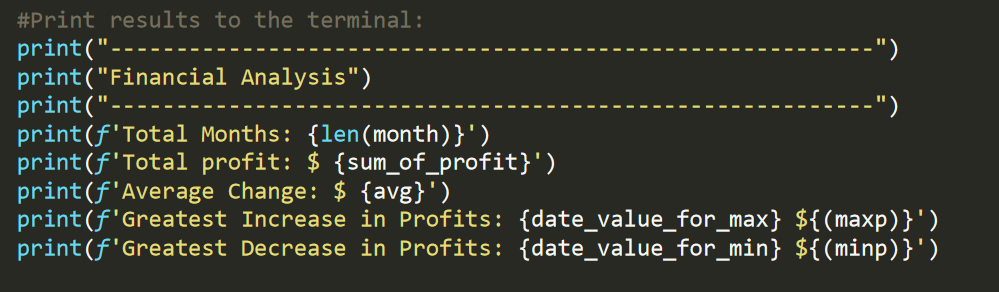
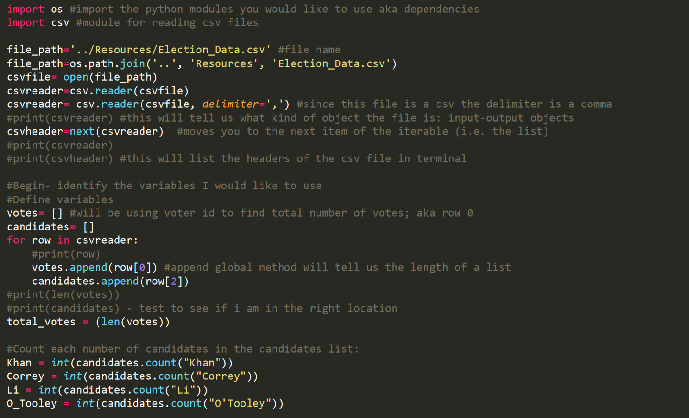

# Python-Challenge

In this assignment, our first introduction to Python, we were asked to read in CSV files into Python and perform various calculations.

In first segement called "PyBank," we analyzed "PyBankData.csv"  Below are some findings:
The Greatest Increase in Profits occured on 12-Feb in the amount of: $1926159
The Greatest Decrease in Profits occured on 13-Sep in the amount of: $-2196167

The findings can be found in the terminal upon running the code along with a corresponding .txt file in the "Analysis" folder.

In the next segment called "PyPoll," we analyzed "Election_Data.csv"  Below are some findings:
Khan captured the majority of votes with 63% and was the winner.

Once again, the findings can be found in the terminal upon running the code along with a corresponding .txt file in the "Analysis" folder.

